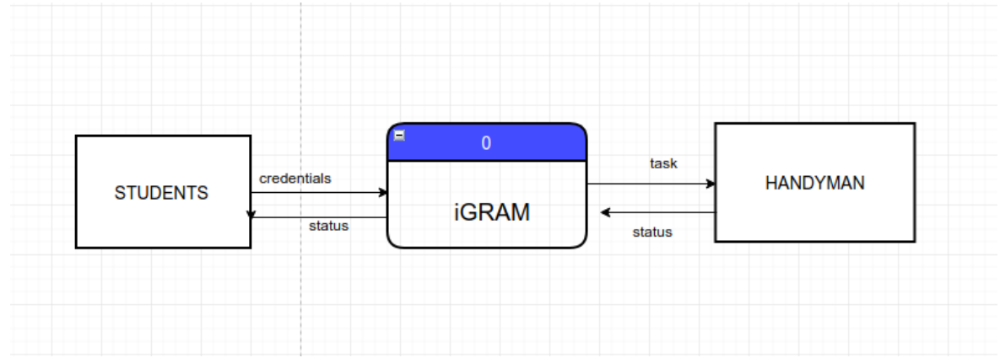
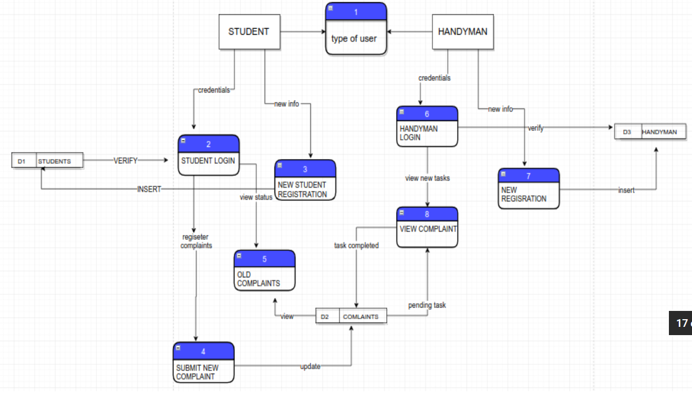
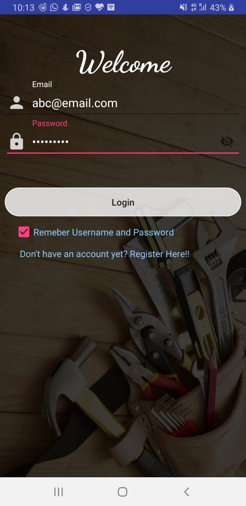
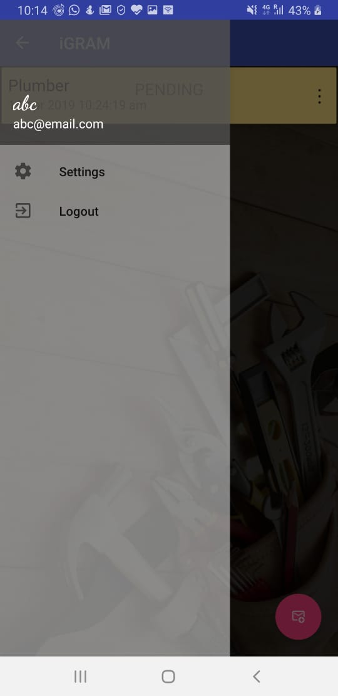
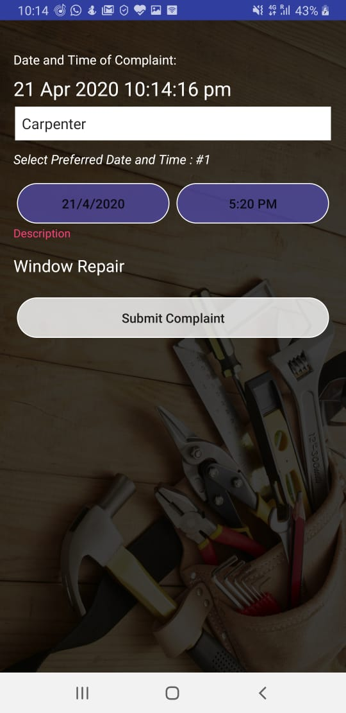
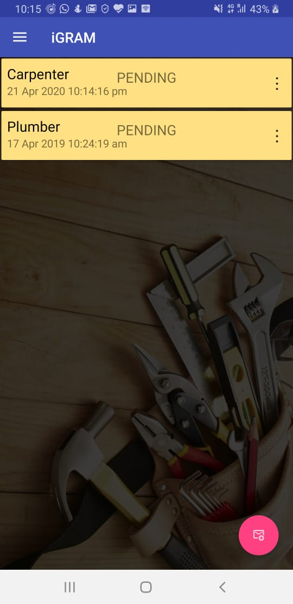
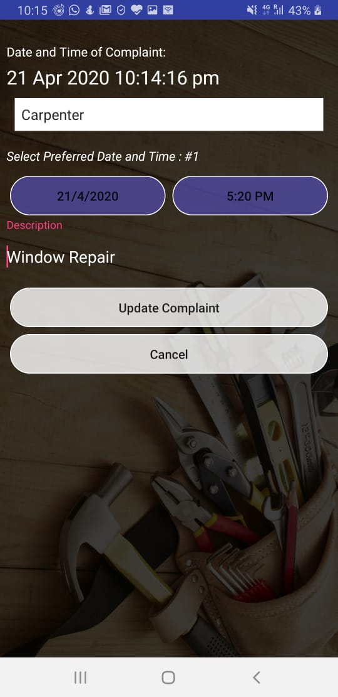

# iGRAM

## Objective:	
To develop an android based  system to replace  the existing complaint system in IIITM Gwalior.The intended system allows the students to report the complaints and also keep track of the progress of reported complaints. The improved system focuses on overcoming the inefficiency and hurdles in the way to achieve a smooth and transparent complaint system from both the users and managements perspective.

## Significance:
The intended system would improve the overall efficiency of the complaint process. The system would ensure better time management, complaint prioritizing and help avoid time mismatch. The students will have a better platform to file complaints and a transparent method to track the progress. On the other hand, th managements will have more suitable and mechanized database to view the information clearly.

### Flow Chart

## Screenshots
### Login : 

### Dashboard : 

### Submit complaint : 

### List of complaints : 

### Update Complaints : 

